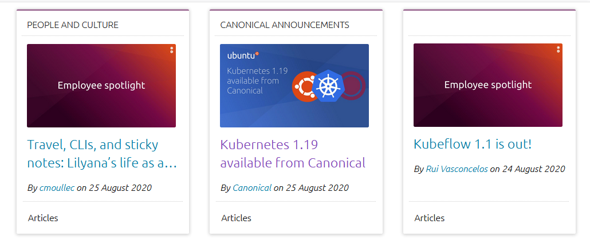

# Blog Post Cards

## About
A take home for Canonical copying a card system using the [Vanilla framework](https://vanillaframework.io/), and VueJS.

The goal was to replicate:


and the end result:



## Setup
Clone this repo and then run

```
npm install
```

### Compiles and hot-reloads for development
```
npm run serve
```

### Compiles and minifies for production
```
npm run build
```

## Notes
Some notes on the final result.

+ The api results were incomplete so I made the judgement to fill in missing data with blank space, to provide consistency in the cards.
+ The author and data text, I decided to be spaced according to top padding, although having it aligned to the bottom would've been fine.
+ The footers have the text "Articles" as opposed to "Article" such as in the original example. I could not find "Article" in the API response used, and so used what the categories section had. One solution to this might be dynamically turning this into a singular, but without knowing the other types of posts, I couldn't effectively do this.
+ I decided to limit the title text to two lines to preserve the look of the card. You could also resize the text to fit the content.
